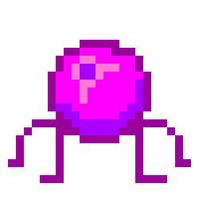

# TheCOOrP

<!-- TODO Remake the logo, use png with palette encoding. -->

Lobotomy Corporation COOP project. Developing a game inspired by Lobotomy Corporation.

   
  

## Links

- [Link to the Demo Video](https://drive.google.com/drive/folders/1pGh9TZ-6xcYVOox96Rov0pG2shFWNsGE?usp=drive_link)
- [Link to video with customer](https://drive.google.com/drive/folders/1dG_BZbB0Pia2oZM1XE1AgbxNdWinBCYa?usp=sharing)

## Description

### Project goal and description

The main goal of our project is creating a spiritual successor to Lobotomy Corporation. Although the original game provides an interesting and hard experience, the main gameplay philosophy makes it so most monsters are abandoned after 2-3 days of care. Changing this, as well as adding multiplayer - are our main priorities.

### Wiki (for customer)

It`s important to keep README clean and structurally clear.

[Wiki link](https://github.com/TheTopSecretTeam/TheCOOrP/wiki)

### Usage instractions

1. In the start menu, you can familiarize yourself with the management and start a new lobby.
2. In the complex, you can move agents, open the anomaly menu and work with it. The choice of job depends on obtaining energy and resources that can be exchanged for equipment in the anomaly menu.
3. After completing the daily quota, you can either stay on the current day or move on to the next one.

### Project installation

Download the latest version from the Itch\.io, then unpack to desired location and launch.

### Project structure clarification (for customer)

It`s important for developers to understand the structure of our repository.

1) **.github**: templates and CI pipeline are stored here.

2) **UI**: external configuration of our UI.

3) **addons**: there is GdUnit4 that we use for unit tests.

4) **docs**: all documentation including images for README and .md files.

5) **img**: there are all sprites for game.

6) **net**: main files connected with multiplayer.

7) **obj**: all objects in game with their functionallity.

8) **others**: everything that doesn't fit the previous folders is stored here. These are mostly global things and the internals of our UI, and the font of our game is also stored.

9) **res**: there is all information about entities stats.

10) **scenes**: there is our map with all scenes.

11) **tests**: there are all unit tests.

## Documentation

- [Contribution](docs/CONTRIBUTING.md)
- [Quality attribute scenarious](docs/quality-attributes/quality-attribute-scenarios.md)
- Quality assurance
  - [Automated tests](docs/quality-assurance/automated-tests.md)
  - [Quality attribute scenarios](docs/quality-assurance/quality-attribute-scenarios.md)
  - [User acceptance tests](docs/quality-assurance/user-acceptance-tests.md)
- [CI](docs/automation/CI.md)
- [Architecture](docs/architecture.md)
