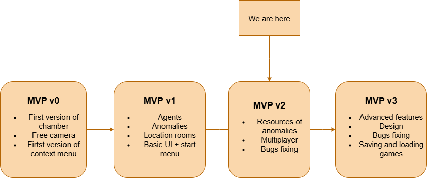

# TheCOOrP

Lobotomy Corporation COOP project. Developing a game inspired by Lobotomy Corporation.

[Link to the up-to-date deployed version of our product](https://drive.google.com/drive/folders/1qRC9B3wtoQ-ucz8oC2EMupoSp4nI6Ttu?usp=drive_link)

[Link to the Demo Video](https://drive.google.com/drive/folders/1pGh9TZ-6xcYVOox96Rov0pG2shFWNsGE?usp=drive_link)

## Description

### Project goal and description

### Project Context diagram

### Feature roadmap

### Usage instractions

1. In the start menu, you can familiarize yourself with the management and start a new lobby.

2. In the complex, you can move agents, open the anomaly menu and work with it. The choice of job depends on obtaining energy and resources that can be exchanged for equipment in the anomaly menu.

3. After completing the daily quota, you can either stay on the current day or move on to the next one.

### Project installation

You install zip folder from the Google disk, unpack it, and load exe file.

## Usage

[Link to video explanations](https://drive.google.com/drive/folders/1pGh9TZ-6xcYVOox96Rov0pG2shFWNsGE?usp=drive_link)

## Links to documentation

[Develoment](docs/CONTRIBUTING.md)

[Quality attribute scenarious](docs/quality-attributes/quality-attribute-scenarios.md)

[Quality assurance](docs/quality-assurance)

[Build and deployment automation](docs/automation)

[Architecture](docs/architecture)
