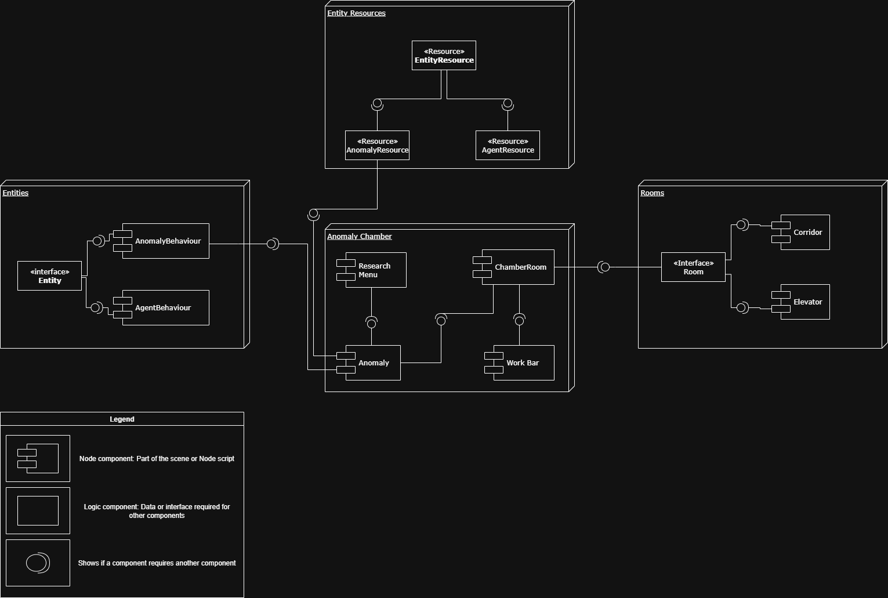
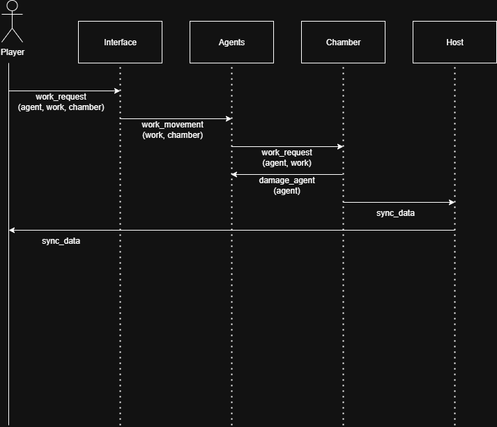
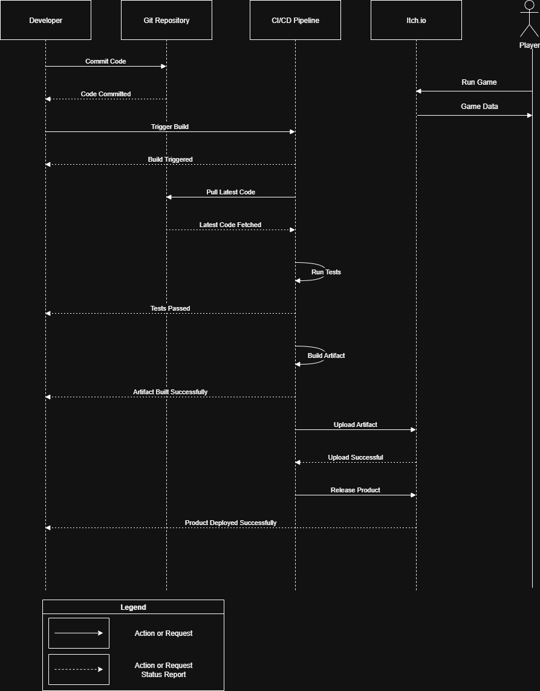

# TheCOOrP
Lobotomy Corporation COOP project

## Usage

Link to video explanations: 

## Architecture

### Static View

#### Component Diagram

#### Coupling and Cohesion
- **Coupling**: Our system demonstrates loose coupling through well-defined interfaces, ensuring components interact without tight dependencies
- **Cohesion**: Components exhibit high cohesion by grouping closely related functionality within single units.

#### Maintainability
Through high modularity of the code, maintaining TheCOOrP is rather simple

### Dynamic View

#### Sequence Diagram

#### Performance Metrics
In production environment, the illustrated scenario takes:
- Average: 87 ms
- Max: 121 ms

### Deployment View

#### Deployment Diagram

#### Deployment Choices
- Customer-side deployment options:
  - itch.io: The game is automatically deployed on itch.io. So, playing the game only requires access to the game's page.
    However, if you want to publish on your own itch.io account, you must follow these steps:
    - 1. Set Up Your itch.io Project
    - 2. Install Butler (itch.io’s CLI Tool)
    - 3. Prepare Your Build for Deployment (Building via Godot)
    - 4. Deploy via Git + Butler (Manual or Automated)

## Development

### Kanban board

Link to the Kanban board:
https://github.com/orgs/TheTopSecretTeam/projects/1/views/8

### Git workflow

We have adopted the GitHub flow for our context.

Main steps:

1. Сreate issues according to templates and label it (type, size, SP, Milestone): https://github.com/TheTopSecretTeam/TheCOOrP/tree/dev/.github/ISSUE_TEMPLATE

2. Any team member can assign issue to himself or anyone else

3. For each feature we create branch and name it as the feature itself. After the work, we merge it with dev branch.

4. Commits should be relevant and clear for all team members

5. After that we create a pull request according to template: https://github.com/TheTopSecretTeam/TheCOOrP/tree/dev/.github/PULL_REQUEST_TEMPLATE

6. Only privileged team members can review. Others can write comments for them or the author of this request.

7. After all these steps, issue can be closed.

## Quality assurance

### Quality attribute scenarios

Link: https://github.com/TheTopSecretTeam/TheCOOrP/blob/dev/docs/quality-assurance/quality-attribute-scenarios.md

### Automated tests

1. Resource utilization

In our case, there are no specific tests for this attribute. We took the minimum system requirements from Lobotomy Corporation and edited them, taking into account Steam and the output load of our laptops and computers.

2. Installability

We will load our game on different systems and calculate the time of (un)installation.

3. Availability

We will start our game on different systems and calculate the time of web version opening.

### User acceptance tests

Link: https://github.com/TheTopSecretTeam/TheCOOrP/blob/dev/docs/quality-assurance/user-acceptance-tests.md

## Build and deployment

### Continuous Integration

According to our problems with linter that works with Godot (PS: it doesn`t work), we do not have CI pipeline.
