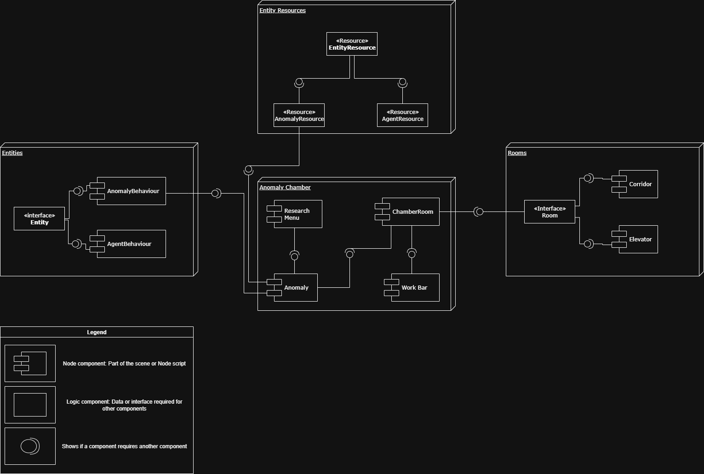
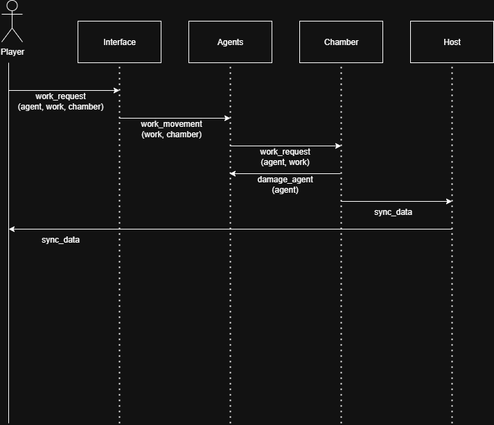
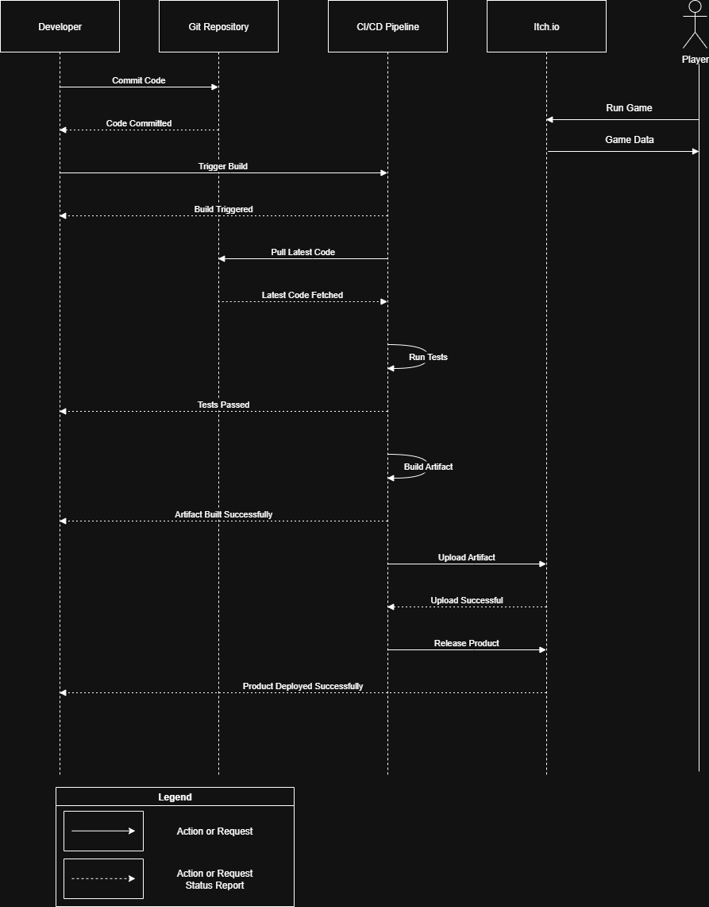

## Architecture

### Static View

#### Component Diagram

#### Coupling and Cohesion

- **Coupling**: Our system demonstrates loose coupling through well-defined interfaces, ensuring components interact without tight dependencies
- **Cohesion**: Components exhibit high cohesion by grouping closely related functionality within single units.

#### Maintainability

Through high modularity of the code, maintaining and analyzing TheCOOrP is rather simple.
Modifications to the project can be made without much effort. Most of the code is susceptible to testing.
Although, the uniqueness of the project limits its reusability.

### Dynamic View

#### Sequence Diagram

#### Performance Metrics

In production environment, the illustrated scenario takes:

- Average: 87 ms
- Max: 121 ms

### Deployment View

#### Deployment Diagram

#### Deployment Choices

- Customer-side deployment options:
  - itch.io: The game is automatically deployed on itch.io. So, playing the game only requires access to the game's page.
    However, if you want to publish on your own itch.io account, you must follow these steps:
    - 1. Set Up Your itch.io Project
    - 2. Install Butler (itch.io’s CLI Tool)
    - 3. Prepare Your Build for Deployment (Building via Godot)
    - 4. Deploy via Git + Butler (Manual or Automated)
